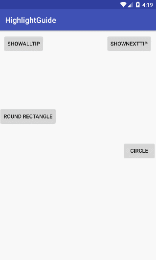

# HighlightGuide [](http://developer.android.com/index.html)  [](https://android-arsenal.com/api?level=15)

HighlightGuide is an Android library used to guide user how to do the next step.



## Features
- Background color
- Circle , Oval and Rounded Rectangle focus shapes
- Custom decor view
- All and Next mode

## Import

### Gradle

1. Define the jitpack remote Maven repository inside the repositories block of your root `build.gradle` file

    ```javascript
    allprojects {
        repositories {
            ...
            maven { url "https://jitpack.io" }
        }
    }
    ```

2. Add the Spotlight dependency

    ```javascript
    dependencies {
        ...
        compile 'com.github.Coder-DanielHan:HighlightGuide:v1.0.1'
    }
    ```

### Maven

1. Define the jitpack remote Maven repository in your `pom.xml` at the end of repositories

    ```xml
    <repositories>
        ...
        <repository>
            <id>jitpack.io</id>
            <url>https://jitpack.io</url>
        </repository>
    </repositories>
    ```

2. Add the Spotlight dependency

    ```xml
    <dependency>
        <groupId>com.github.Coder-DanielHan</groupId>
        <artifactId>HighlightGuide</artifactId>
        <version>v1.0.1</version>
    </dependency>
    ```

Maven

    <dependency>
        <groupId>it.chengdazhi.styleimageview</groupId>
        <artifactId>styleimageview</artifactId>
        <version>1.0.4</version>
        <type>pom</type>
    </dependency>

## Usage
```java
mGuide = new GuideBuilder(MainActivity.this)
        .isInterceptClick(true)
        .isClickDismiss(false)
        .setEnableNext(true)
        .setBgColorResId(R.color.highlight)
        .addItem(new Item(new CircleHighlightShape(40), R.id.btn_rightLight, R.layout.info_gravity_left_down, Item.ANCHOR_LEFT, Item.FIT_END, -5, 0, null))
        .addItem(new Item(new RectHighlightShape(40, 10, 10), R.id.btn_light, R.layout.info_gravity_left_down, Item.ANCHOR_RIGHT, Item.FIT_START, 5, 0, null))
        .build();
mGuide.setOnClickListener(new HighlightGuideInterface.OnClickListener() {
    @Override
    public void onClick() {
        Toast.makeText(MainActivity.this, "clicked and show next tip view by yourself", Toast.LENGTH_SHORT).show();
        mGuide.next();
    }
});
mGuide.show(MainActivity.this);
```
method | desc
 --- | ---
isInterceptClick | is to intercept click event or not
isClickDismiss | is to click to dismiss or not
setEnableNext | is to enable next mode or not
setBgColorResId | set background color
addItem | add item
next | change to next anchor view
show | show the view
hide | hide the view

## Thanks
[https://github.com/hongyangAndroid/Highlight](https://github.com/hongyangAndroid/Highlight)

License
=======

    Copyright 2017 Faruk Toptaş

    Licensed under the Apache License, Version 2.0 (the "License");
    you may not use this file except in compliance with the License.
    You may obtain a copy of the License at

       http://www.apache.org/licenses/LICENSE-2.0

    Unless required by applicable law or agreed to in writing, software
    distributed under the License is distributed on an "AS IS" BASIS,
    WITHOUT WARRANTIES OR CONDITIONS OF ANY KIND, either express or implied.
    See the License for the specific language governing permissions and
    limitations under the License.


